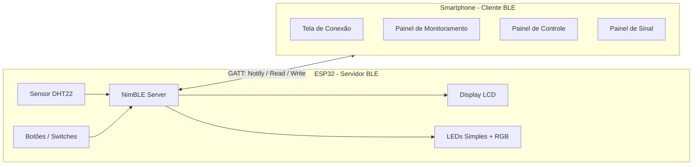
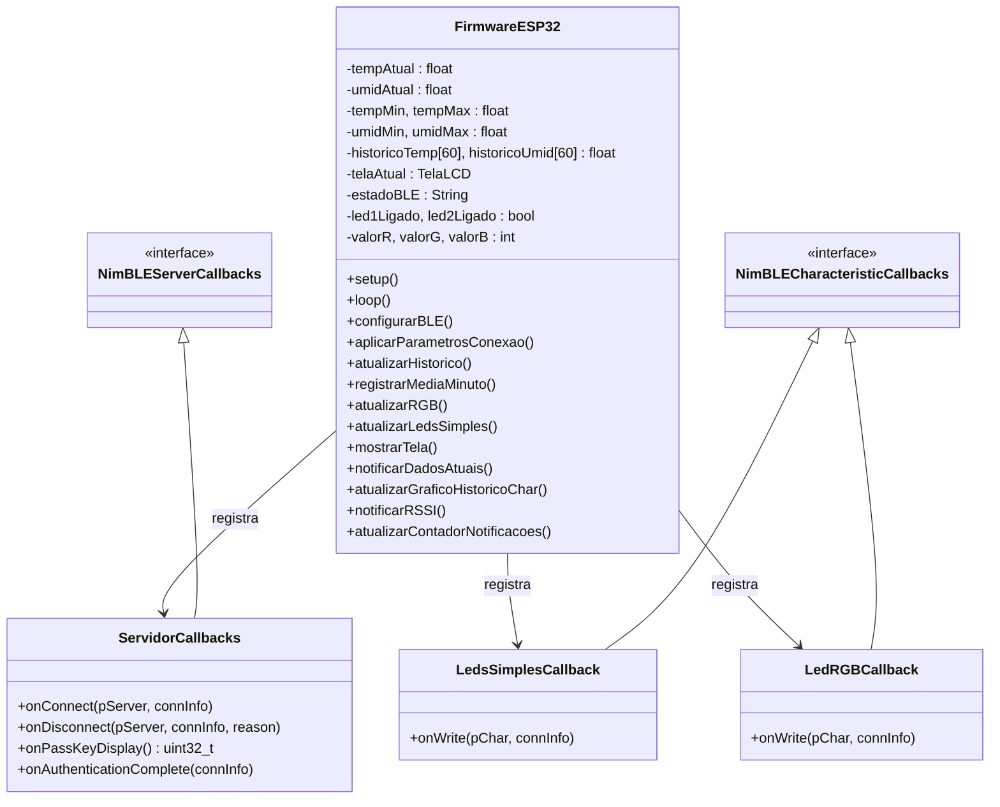
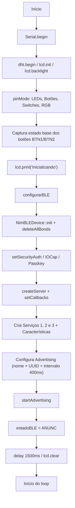
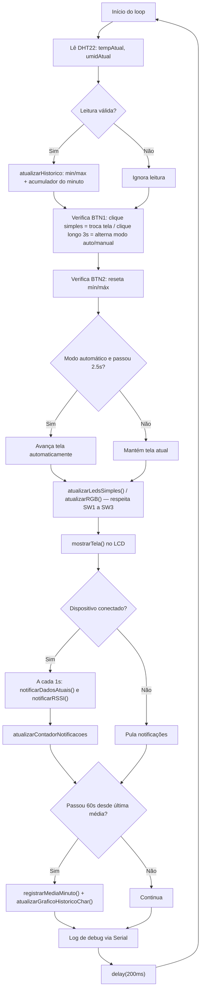
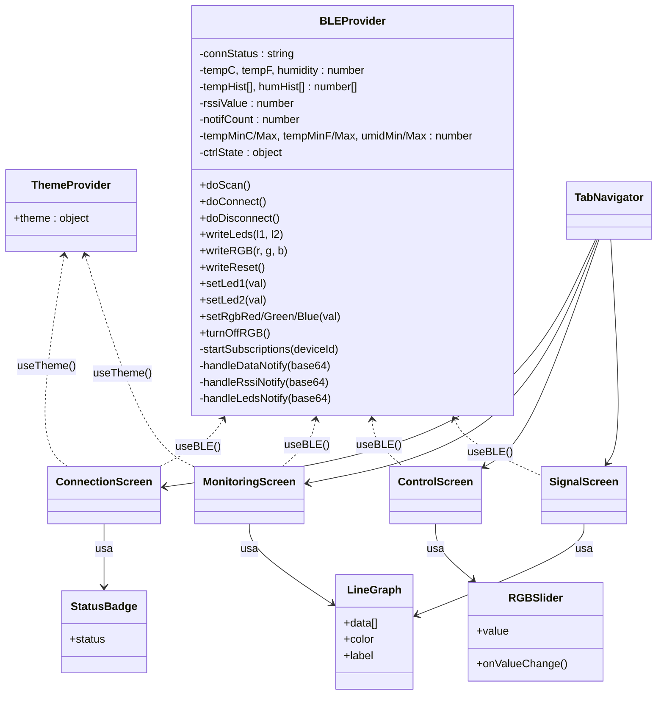

# Documentação do Projeto — Monitoramento de Temperatura usando BLE e ESP32

> Autor: Henrique Eduardo Simonato — 2221101008

---

## Sumário

1. [Visão geral da arquitetura](#1-visão-geral-da-arquitetura)
2. [Firmware ESP32 — Diagrama de classes](#2-firmware-esp32--diagrama-de-classes)
3. [Firmware ESP32 — Fluxograma (setup, loop e callbacks)](#3-firmware-esp32--fluxograma-setup-loop-e-callbacks)
4. [Tabela GATT (Serviços e Características)](#4-tabela-gatt-serviços-e-características)
5. [Aplicativo Mobile — Diagrama de classes/componentes](#5-aplicativo-mobile--diagrama-de-classescomponentes)
6. [Aplicativo Mobile — Descrição das principais funções](#6-aplicativo-mobile--descrição-das-principais-funções)
7. [Instruções de compilação e instalação](#7-instruções-de-compilação-e-instalação)

---

## 1. Visão geral da arquitetura

O sistema é composto por dois componentes principais que se comunicam via **BLE (GATT)**:

---

## 2. Firmware ESP32 — Diagrama de classes

O firmware utiliza três classes de *callback* (herdadas da biblioteca **NimBLE-Arduino**), além das funções e variáveis globais que compõem a lógica principal.

### Descrição das classes

| Classe | Responsabilidade |
|---|---|
| `ServidorCallbacks` | Trata eventos do servidor BLE: conexão, desconexão, exibição do *passkey* no LCD (`onPassKeyDisplay`) e resultado da autenticação. |
| `LedsSimplesCallback` | Trata escrita (`WRITE`) na característica de LEDs simples. Respeita o bloqueio do `SW1` (modo local) e interpreta o byte recebido (bit 0 = LED1, bit 1 = LED2; valor `255` = comando especial de reset de mín/máx). |
| `LedRGBCallback` | Trata escrita (`WRITE WITHOUT RESPONSE`) na característica do LED RGB, decodificando os 3 bytes `[R, G, B]`. |

---

## 3. Firmware ESP32 — Fluxograma (setup, loop e callbacks)

### 3.1. `setup()`

### 3.2. `loop()`

### 3.3. Callbacks BLE (eventos assíncronos)

```mermaid
flowchart TD
    subgraph onConnect
        A1[Cliente conecta] --> A2[dispositivoConectado = true]
        A2 --> A3[aplicarParametrosConexao]
        A3 --> A4[startSecurity → solicita Passkey]
    end
    subgraph onPassKeyDisplay
        B1[Pareamento solicitado] --> B2["Exibe senha de 6 dígitos no LCD e Serial"]
    end
    subgraph onDisconnect
        C1[Cliente desconecta] --> C2[dispositivoConectado = false]
        C2 --> C3[estadoBLE = ANUNC]
        C3 --> C4[startAdvertising novamente]
    end
    subgraph onWrite_LEDs
        D1["APP escreve na característica LEDs"] --> D2{SW1 em modo local?}
        D2 -->|Sim| D3[Ignora comando do APP]
        D2 -->|Não| D4{Byte recebido == 255?}
        D4 -->|Sim| D5[Reset de mín/máx]
        D4 -->|Não| D6["Atualiza led1Ligado / led2Ligado via bits 0 e 1"]
    end
    subgraph onWrite_RGB
        E1["APP escreve 3 bytes R,G,B"] --> E2{SW1 em modo local?}
        E2 -->|Sim| E3[Ignora comando do APP]
        E2 -->|Não| E4[Atualiza valorR, valorG, valorB]
    end
```

---

## 4. Tabela GATT (Serviços e Características)

Tabela completa, extraída diretamente das constantes e propriedades definidas no firmware (`teste.ino`).

| Serviço | UUID do Serviço | Característica | UUID da Característica | Propriedades | Formato / Funcionamento |
|---|---|---|---|---|---|
| **1. Monitoramento Ambiental** | `0000181A-0000-1000-8000-00805F9B34FB` (Environmental Sensing — padrão Bluetooth SIG) | Dados Atuais | `0000181B-0000-1000-8000-00805F9B34FB` | `READ`, `NOTIFY` | String ASCII `"tempC,tempF,umid,sw4"` (ex: `"24.5,76.1,58.3,0"`). Notificada a cada **1 s** quando conectado. O último campo indica o estado do `SW4` (0 = °C, 1 = °F, usado pelo app para escolher a escala do gráfico). |
| | | Gráfico Histórico | `0000181C-0000-1000-8000-00805F9B34FB` | `READ` | String com até 60 médias por minuto, formato `"temp;umid|temp;umid|..."`. Atualizada a cada minuto. |
| **2. Controle de Atuadores** | `5b1d1a00-0001-4a2e-9e2a-111111111111` (custom 128-bit) | LEDs Simples | `5b1d1a00-0002-4a2e-9e2a-111111111111` | `READ`, `WRITE`, `NOTIFY` | 1 byte: bit 0 = LED1 (vermelho), bit 1 = LED2 (verde). Valor especial `255` = comando de **reset de mín/máx** enviado pelo app. Notifica o app sempre que o estado muda (inclusive por switch local). |
| | | LED RGB | `5b1d1a00-0003-4a2e-9e2a-111111111111` | `WRITE WITHOUT RESPONSE` | 3 bytes `[R, G, B]`, 0–255 cada, aplicados via PWM (RGB ânodo comum → lógica invertida internamente). |
| **3. Indicadores de Conexão** | `5b1d1a00-0011-4a2e-9e2a-222222222222` (custom 128-bit) | RSSI | `5b1d1a00-0012-4a2e-9e2a-222222222222` | `READ`, `NOTIFY` | String ASCII com valor de RSSI em dBm (`ble_gap_conn_rssi`). Notificada a cada 1 s. |
| | | Contador de Notificações | `5b1d1a00-0013-4a2e-9e2a-222222222222` | `READ` | String ASCII com a quantidade de notificações de dados enviadas no último minuto de conexão. |

### Parâmetros de rádio aplicados

| Parâmetro | Valor configurado no código |
|---|---|
| Advertising Interval | `setMinInterval(640)` / `setMaxInterval(640)` → 640 × 0,625 ms = **400 ms** |
| Min Connection Interval | 40 × 1,25 ms = **50 ms** |
| Max Connection Interval | 80 × 1,25 ms = **100 ms** |
| Slave Latency | **0** |
| Supervision Timeout | 200 × 10 ms = **2000 ms** |

### Segurança

- Pareamento configurado via `NimBLEDevice::setSecurityAuth(true, true, true)` (Bonding + MITM + Secure Connections) e `setSecurityIOCap(BLE_HS_IO_DISPLAY_ONLY)` → modelo **Passkey Entry**, com senha estática definida em `BLE_PASSKEY` (`123456`).
- ⚠️ **Observação para o relatório**: no código atual, o comentário `// Flags _ENC removidas temporariamente (modo teste sem seguranca)` indica que as *flags* de criptografia (`NIMBLE_PROPERTY::READ_ENC` / `WRITE_ENC`) foram retiradas das características durante os testes. A negociação de segurança a nível de conexão (passkey/MITM) continua ativa em `onConnect`, mas vale registrar esse ponto como uma pendência/nota de manutenção na documentação, já que a conexão deveria exigir criptografia com autenticação.

---

## 5. Aplicativo Mobile — Diagrama de classes/componentes

O aplicativo é construído em **React Native**, organizado em *Contexts* (estado global), componentes visuais reutilizáveis e telas (*screens*) consumidas por uma navegação em abas.

---

## 6. Aplicativo Mobile — Descrição das principais funções

### 6.1. `BLEProvider` (contexto global de BLE — acessado via `useBLE()`)

| Função | Descrição |
|---|---|
| `doScan()` | Inicia o *scan* BLE (timeout de 15 s), filtrando dispositivos pelo nome `HS-ESP32-BLE`. Ao encontrar, salva o dispositivo e interrompe o *scan*. |
| `doConnect()` | Conecta ao dispositivo encontrado e, em caso de sucesso, chama `startSubscriptions`. |
| `doDisconnect()` | Cancela as notificações ativas e desconecta do ESP32. |
| `startSubscriptions(deviceId)` | Assina (`Notify`) as características de Dados Atuais, RSSI e LEDs Simples; também agenda a leitura do Contador de Notificações a cada 60 s. |
| `handleDataNotify(base64)` | Decodifica o payload Base64 recebido (`temp,umid...`), atualiza temperatura/umidade, histórico (máx. 60 pontos) e mín/máx; troca a escala do gráfico (°C/°F) conforme o estado do `SW4`. |
| `handleRssiNotify(base64)` | Decodifica e atualiza o valor de RSSI exibido na tela de sinal. |
| `handleLedsNotify(base64)` | Decodifica o byte de estado dos LEDs simples e sincroniza os *toggles* da UI quando a mudança vem do firmware (ex: switch físico). |
| `writeLeds(l1, l2)` / `setLed1` / `setLed2` | Monta o byte de comando (bit 0/1) e escreve (`Write` com resposta) na característica de LEDs. |
| `writeRGB(r, g, b)` / `setRgbRed/Green/Blue` | Escreve os 3 bytes `[R, G, B]` na característica RGB usando `Write Without Response`, permitindo transição fluida das cores. |
| `writeReset()` | Envia o byte especial `255` para resetar mín/máx no ESP32 e zera os valores correspondentes localmente no app. |
| `turnOffRGB()` | Define R, G, B = 0 e envia o comando ao ESP32. |

### 6.2. Componentes visuais reutilizáveis

| Componente | Descrição |
|---|---|
| `LineGraph` | Gráfico de linha "feito à mão" (sem libs de chart) que desenha pontos e segmentos via `View`s posicionadas, usado para Temperatura, Umidade e RSSI. |
| `RGBSlider` | Slider customizado (toque/arraste) que converte a posição horizontal em um valor de 0–255 para cada canal de cor. |
| `StatusBadge` | Indicador visual do estado da conexão (`disconnected`, `scanning`, `found`, `connecting`, `connected`), com cor e ícone correspondentes. |

### 6.3. Telas (Screens)

| Tela | Função |
|---|---|
| `ConnectionScreen` | Scanner BLE, exibição do status de conexão e ação de conectar/desconectar do ESP32. |
| `MonitoringScreen` | Exibe temperatura (°C/°F), umidade e os gráficos históricos da última hora. |
| `ControlScreen` | Controle dos LEDs simples (toggles), do LED RGB (sliders + color preview) e botão de reset de mín/máx. |
| `SignalScreen` | Exibe RSSI atual, escala de qualidade do sinal e contador de notificações recebidas. |
| `TabNavigator` | Organiza as quatro telas acima em uma navegação por abas inferior. |

---

## 7. Instruções de compilação e instalação

### 7.1. Firmware (ESP32 — Arduino IDE)

**Requisitos:**
- Arduino IDE 1.8.x ou 2.x com suporte à placa **ESP32** instalado (Boards Manager).
- Bibliotecas (Library Manager):
  - `NimBLE-Arduino`
  - `LiquidCrystal_I2C`
  - `DHT sensor library` (Adafruit) + `Adafruit Unified Sensor`

**Passos:**
1. Abra o arquivo `teste.ino` no Arduino IDE.
2. Em **Ferramentas → Placa**, selecione *ESP32 Dev Module* (ou equivalente).
3. Selecione a porta serial correspondente ao ESP32 conectado via USB.
4. Clique em **Verificar** para compilar e depois em **Carregar** para gravar.
5. Abra o **Monitor Serial** em **115200 baud** para acompanhar os logs de inicialização do BLE.
6. Caso não tenha o hardware físico, utilize o link do Wokwi do projeto (já referenciado no cabeçalho do código) para simular a montagem.

### 7.2. Aplicativo Mobile

**Requisitos:**
- Node.js LTS instalado.
- Projeto React Native (Expo ou bare workflow, conforme a estrutura do repositório).
- Dispositivo ou emulador **Android 10+** com Bluetooth e Localização habilitados (exigidos pelo BLE no Android).

**Passos sugeridos:**
1. Clone o repositório e entre na pasta do app.
2. Instale as dependências: `npm install` (ou `yarn install`).
3. Para testar em desenvolvimento: `npx expo start` e abra no dispositivo via Expo Go, **ou** `npx expo run:android` para gerar um build de desenvolvimento.
4. Para gerar o `.apk` de entrega:
   - Via Expo Application Services: `eas build -p android --profile preview` (gera um `.apk`/`.aab` para download); ou
   - Via build local: `cd android && ./gradlew assembleRelease`, com o `.apk` resultante em `android/app/build/outputs/apk/release/`.
5. Transfira o `.apk` para o celular Android e instale manualmente (habilitando "Instalar de fontes desconhecidas" se necessário).
6. Ao abrir o app, conceda as permissões de **Bluetooth** e **Localização**, vá até a aba **Conexão**, toque em **Buscar**, selecione o `HS-ESP32-BLE` e digite o passkey exibido no LCD do ESP32 quando solicitado pelo pop-up nativo do Android.

